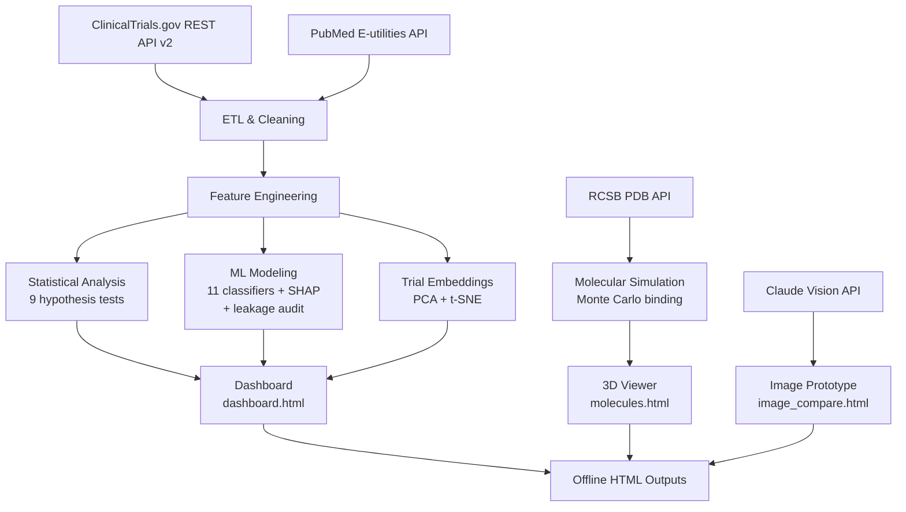

# Oncology Gene-Editing Trial Intelligence Platform

> An end-to-end analytics pipeline for exploring completion patterns, enrollment predictors, and therapy-type distributions across 4,460 interventional oncology clinical trials from ClinicalTrials.gov and PubMed (1990–2025).

**Author:** Lakshay Mani | MS Analytics — Statistical Modeling, Northeastern University
**GitHub:** [@LakshayMani0406](https://github.com/LakshayMani0406)


---

## Overview

This project builds an observational analytics platform on publicly available oncology clinical trial registrations. The primary objective is to identify features associated with trial completion and to characterize structural differences across cancer types, therapy modalities, and trial phases — with the broader goal of understanding where research activity is concentrated and where gaps exist.

This is an observational study of trial registration metadata. All associations reported are correlational. No causal claims are made.

---

## Architecture



---

## Data

| Source | Method | Output |
|---|---|---|
| ClinicalTrials.gov | REST API v2, 28 keyword queries, deduplicated by NCT ID | 7,794 raw → 4,460 cleaned records |
| PubMed / NCBI | E-utilities, 7 query terms, 2013–2024 | Annual publication counts |
| RCSB PDB | REST API, 10 protein structures | Cα backbone coordinates |

**No API keys required** for data collection. Data is fetched at runtime from open government databases.

### Cohort definition

The cohort is **keyword-defined**, not expert-curated. 28 broad search terms covering CRISPR, CAR-T, TCR therapy, TIL, NK cell, gene editing, base/prime editing, viral vectors, mRNA, oncolytic virus, and adjacent modalities were submitted to the ClinicalTrials.gov REST API. Records were deduplicated by NCT ID. This means the cohort includes any interventional cancer trial whose registration text matches one of these terms — it does not represent a clinically validated set of "gene-editing trials." A CAR-T trial that uses CRISPR-edited T cells, for example, is captured by multiple queries and counted once. Trials that mention "gene therapy" only incidentally in their title are also included.

---

## Pipeline

```
fetch_data.py           →  raw/          (7,794 unique trials)
clean_data.py           →  data/         (4,460 records × 23 features)
eda.py                  →  fig1–fig3     (distributions, correlations)
statistical_tests.py    →  fig4          (9 hypothesis tests)
ml_models.py            →  model_results.json, fig5–fig7
leakage_audit.py        →  leakage_audit.json    (registration-time vs full-feature comparison)
new_findings.py         →  findings.json
dashboard.py            →  dashboard.html
molecular_simulation.py →  molecular_insights.json
molecules.py            →  molecules.html
trial_embeddings.py     →  trial_embeddings.json
advanced_simulation.py  →  advanced_simulation.json
image_compare.py        →  image_compare.html
patch_theme.py          →  applies unified UI theme to all HTML outputs
```

---

## Methodology

### Data Cleaning
- Restricted to interventional trials with valid start dates (≥ 1990) and known status
- Enrollment capped at 20,000 to remove data entry outliers
- 50+ regex-based cancer type classifiers applied to `conditions` field
- Binary outcome label: `1` = COMPLETED / ACTIVE_NOT_RECRUITING / RECRUITING; `0` = TERMINATED / WITHDRAWN / SUSPENDED; unlabeled trials excluded from supervised tasks

> **Note on target definition.** Bundling RECRUITING and ACTIVE_NOT_RECRUITING into the "success" class is a simplification — those trials have not actually completed. A stricter definition (COMPLETED vs TERMINATED/WITHDRAWN only) would yield a smaller, cleaner cohort. This is left for future work.

### Feature Engineering
Two feature sets are evaluated:

| Set | Features | Use case |
|---|---|---|
| **Full** | log_enrollment, start_year, n_countries, n_primary_outcomes, is_hematologic, is_recent, results_available, phase_clean, cancer_type, tumor_category, sponsor_class, trial_era | Headline AUC (with leakage caveat) |
| **Registration-only** | start_year, n_primary_outcomes, is_hematologic, is_recent, phase_clean, cancer_type, tumor_category, sponsor_class, trial_era | Honest prospective AUC |

### ML Modeling
- 80/20 stratified train/test split; random seed fixed at 42 across all models
- 3-fold cross-validated GridSearchCV for Random Forest (32 configs) and XGBoost (36 configs)
- Evaluation metric: AUC-ROC (chosen over accuracy due to class imbalance ~81% majority class)
- SHAP values computed on held-out test set for the tuned Random Forest
- Standalone `leakage_audit.py` re-runs three sklearn-native models (Logistic Regression, Random Forest, Gradient Boosting) on both feature sets to quantify the AUC drop

### Statistical Tests
All tests are two-sided. Significance threshold α = 0.05. Multiple comparisons noted where applicable. Effect sizes reported alongside p-values.

### Bootstrap Confidence Intervals
10,000 bootstrap resamples with replacement. 95% CIs reported as 2.5th–97.5th percentile of the bootstrap distribution. Permutation tests use 10,000 shuffles.

---

## Key Observations

These are patterns observed in the dataset. They describe associations, not causal relationships.

| Observation | Result |
|---|---|
| Enrollment is associated with completion | Point-biserial r = 0.48, p < 0.0001; enrollment ≥ 10 associated with +52.1pp completion rate (95% CI: [48.1, 56.1]) |
| Hematologic vs. solid tumor trial volume gap | Widening at approximately +0.49pp/year over the study period |
| Phase attrition | 75.7% of Phase I trials have a Phase II record; 11.3% have a Phase III record |
| Trial volume trend | Linear fit projects approximately 715 new registrations/year by 2030 (R² = 0.818 on 2013–2024 data) |
| Therapy-type country concentration | CAR-T registrations concentrated in China (30%) and US (12%); NK cell concentrated in South Korea (12%) |
| Dual-target trial proportion | Increased from 0% (2013) to 3.8% (2024); linear trend p = 0.046 |

**Caution:** These observations are derived from trial registration metadata, not from patient outcome data. Completion status reflects administrative trial status, not clinical efficacy.

### On the "Treatment Desert"

The largest mortality-adjusted disparity in the dataset is between Pancreatic Cancer (105 trials, ~50K US deaths/year) and Leukemia (ALL) (262 trials, ~1.6K US deaths/year) — a ~79× gap in trials-per-death. This is a real observed disparity, but the ratio is fragile and reflects several factors beyond research funding:

1. **Denominator mismatch.** US-specific mortality (NCI SEER 2023) is compared against globally registered trials (ClinicalTrials.gov is US-centric but international).
2. **Biological tractability.** Pancreatic cancer is genuinely harder to drug with gene-editing approaches — KRAS mutations dominate, the stroma is dense, and few well-validated cell-surface targets exist analogous to CD19 in B-cell malignancies.
3. **Cohort sensitivity.** The 28-query keyword filter favors modalities that already have validated targets (CAR-T → CD19/BCMA/CD33), which biases the cohort toward hematologic cancers.

A fairer framing: *Mortality-adjusted research investment varies by roughly 80× across cancer types in this cohort, partly driven by the availability of tractable molecular targets.*

---

## ML Results

### Honest comparison: full features vs. registration-time-only

The full feature set includes signals partly determined by trial conduct (`log_enrollment` becomes the ACTUAL enrolled count, which for terminated trials is mechanically small; `results_available` is true only for trials that completed AND posted results; `n_countries` can grow during conduct). These features inflate the AUC because the model is partly learning the trial outcome from features that themselves depend on the outcome.

The registration-only feature set drops `log_enrollment`, `results_available`, and `n_countries`. This is the model that could be used at trial registration to estimate completion risk prospectively. Both numbers are reported below; the registration-only number is the honest one.

| Configuration | Best Model | Test AUC-ROC |
|---|---|---|
| Full feature set (with conduct-time signal) | Soft Voting Ensemble | **0.8996** |
| Registration-time only (no leakage) | Random Forest | **0.7185** |
| **Drop attributable to leakage** | — | **−0.181** |

Full audit table (standalone `leakage_audit.py`):

| Model | Full AUC | Reg-only AUC | Δ AUC |
|---|---|---|---|
| Logistic Regression | 0.8863 | 0.6662 | −0.2201 |
| Random Forest | 0.8963 | 0.7185 | −0.1778 |
| Gradient Boosting | 0.8925 | 0.7062 | −0.1863 |

The 0.181 AUC drop confirms that a substantial fraction of the headline number was driven by conduct-time features. **At the same time, the registration-only AUC of 0.7185 is meaningfully above the 0.5 baseline** — trial phase, cancer type, sponsor class, era, and tumor category carry real prospective signal. The headline ~0.90 should not be cited as a prospective prediction accuracy; ~0.72 is the number that survives the leakage check.

### Full-feature model comparison (all 11 classifiers)

| Model | Test AUC-ROC |
|---|---|
| Soft Voting Ensemble | 0.8996 |
| XGBoost | 0.8987 |
| Random Forest (Tuned) | 0.8970 |
| LightGBM | 0.8950 |
| SVM (RBF) | 0.8949 |
| XGBoost (Tuned) | 0.8941 |
| Random Forest | 0.8933 |
| Gradient Boosting | 0.8925 |
| Logistic Regression | 0.8863 |
| Extra Trees | 0.8658 |
| K-Nearest Neighbors | 0.8381 |

**Top SHAP features (test set, full model):** log_enrollment, results_available, phase_num, is_hematologic, year_norm.

The fact that `log_enrollment` and `results_available` dominate SHAP importance is the direct visual confirmation of the leakage — these are exactly the features dropped in the registration-time audit.

### Class-level performance (Soft Voting Ensemble, holdout test set)

|  | Precision | Recall | F1 | Support |
|---|---|---|---|---|
| Terminated/Withdrawn | 0.64 | 0.72 | 0.68 | 141 |
| Completed/Active | 0.93 | 0.90 | 0.92 | 608 |
| **Macro avg** | 0.79 | 0.81 | 0.80 | 749 |

The model is substantially better at identifying completions (93/90 P/R) than terminations (64/72 P/R). For prospective risk estimation, the terminated-class numbers are what matter — and they are modest. This further argues against citing the 0.90 number as a "trial success predictor."

---

## Statistical Tests

| Test | Variable | Result |
|---|---|---|
| Levene's | Enrollment variance across cancer types | Heteroscedasticity confirmed |
| One-Way ANOVA | Log-enrollment by cancer type | Significant (p < 0.001) |
| Kruskal-Wallis | Log-enrollment by cancer type | Confirms non-parametric result |
| Tukey HSD | Pairwise cancer type comparisons | Hematologic types show higher enrollment |
| Mann-Whitney U | Hematologic vs. solid tumor enrollment | Significant (p < 0.001) |
| Welch's t-test | Hematologic vs. solid tumor enrollment | Cohen's d = 0.31 (small-medium effect) |
| Chi-square | Tumor category × completion outcome | p < 0.0001 |
| Chi-square | Trial phase × completion outcome | p < 0.001 |
| Point-biserial | Enrollment × completion outcome | r = 0.48, p < 0.0001 |

---

## Supplementary Analyses

### Trial Embeddings
PCA-reduced 12-dimensional feature vectors projected via t-SNE (perplexity = 40). Visualizations suggest partial distributional separation between hematologic and solid tumor trials in the 2D embedding space (centroid distance: 65.8 t-SNE units; spread ratio: 2.56×). Note: t-SNE distances are not linearly interpretable and do not imply statistical separability. These visualizations are exploratory.

### Molecular Simulation
Monte Carlo binding probe simulation (50,000 probes × 3 probe types) on Cα backbone coordinates from RCSB PDB structures. Druggability scores are heuristic estimates derived from probe binding energy distributions, computed against backbone atoms only with no side chains, no electrostatics, and no solvation modeling. These are not validated against experimental assay data. Results are illustrative of pocket accessibility patterns at the backbone level only and should not be interpreted as drug discovery output.

### Image Analysis Prototype
Experimental module using Claude Vision (Anthropic) to assess relevance of uploaded biomedical images relative to a fixed set of protein targets and cancer type labels. This is a prototype with no clinical validation. Outputs should not be interpreted as diagnostic or scientifically validated classifications.

### Dashboard Tabs — Interpretation Notes

- **Trial Outcome Predictor tab.** This tab uses a hand-coded scoring function based on the observed associations in the dataset (phase, enrollment, sponsor class, multinational status). It is **not** running the trained ML model on user input. It is presented as an illustrative scoring tool, not as a calibrated prediction system.
- **Compare + AI tab.** The 105 pre-generated cancer-pair analyses are produced by a language model (Claude) reasoning over the dataset statistics. They are AI-generated clinical context, not data-derived findings. Useful as an explainer layer, not as evidence.

---

## Limitations

- **Observational data only.** All analyses are based on trial registration metadata from ClinicalTrials.gov. No patient-level outcome data is used.
- **Completion ≠ efficacy.** Trial completion status reflects administrative outcomes, not treatment effectiveness or patient benefit.
- **Registration bias.** Trials may be registered but never initiated, or completed without publishing results. The dataset captures registrations, not actual trial conduct.
- **Data leakage in the headline AUC.** The full-feature model includes `log_enrollment`, `results_available`, and `n_countries` — features partly determined by trial conduct. The registration-time audit quantifies the AUC drop when these are excluded (0.8996 → 0.7185, a 0.181 drop). The registration-time number is the prospectively usable one.
- **Class imbalance.** The majority class (completion = 1) comprises ~81% of labeled trials. Models are evaluated on AUC-ROC to account for this; accuracy metrics should be interpreted cautiously. The model is much better at identifying completions (93% precision) than terminations (64% precision).
- **Target definition.** Including RECRUITING and ACTIVE_NOT_RECRUITING in the success class conflates ongoing trials with completed ones. A stricter target (COMPLETED vs TERMINATED only) is left for future work.
- **Cohort is keyword-defined.** 28 broad text queries against ClinicalTrials.gov, deduplicated by NCT ID. This is not a curated set of validated gene-editing trials.
- **t-SNE limitations.** t-SNE is a non-linear dimensionality reduction technique. Cluster distances and sizes in t-SNE plots are not directly interpretable. Separation observed visually does not imply statistical significance.
- **Molecular simulation.** The binding simulations use simplified force field approximations on Cα backbone coordinates only — no side chains, electrostatics, or solvation. Results are not validated against experimental binding affinities.
- **Image prototype.** The Claude Vision integration is an exploratory prototype with no clinical validation. It should not be used for medical inference.
- **External validity.** Findings are specific to this dataset and time period. Generalization to other registries or trial populations requires further validation.

---

## Setup & Reproduction

```bash
git clone https://github.com/LakshayMani0406/gene-editing-cancer-trials.git
cd gene-editing-cancer-trials

# Install dependencies
pip install requests numpy pandas matplotlib seaborn scipy scikit-learn xgboost lightgbm shap

# Run core pipeline in order
python3 fetch_data.py           # ~25–35 min — API data collection
python3 clean_data.py
python3 eda.py
python3 statistical_tests.py
python3 ml_models.py            # 11 classifiers, GridSearchCV, SHAP
python3 leakage_audit.py        # standalone — registration-time AUC comparison
python3 new_findings.py
python3 dashboard.py

# Extended analyses (optional)
python3 molecular_simulation.py
python3 molecules.py
python3 trial_embeddings.py
python3 advanced_simulation.py

# Experimental prototype (requires Anthropic API key)
python3 image_compare.py

# Apply unified theme and navigation to all HTML outputs
python3 patch_theme.py

# Serve outputs locally
cd outputs && python3 -m http.server 8080
# Open: http://localhost:8080/dashboard.html
```

**Reproducibility:** All random seeds set to 42. NumPy and scikit-learn random states fixed. t-SNE uses `random_state=42`. Bootstrap resamples use `np.random.seed(42)`.

**macOS note.** Section 10 of `ml_models.py` (the leakage audit) can segfault on macOS due to an OpenMP conflict between XGBoost/LightGBM and sklearn when run in the same Python process after a long pipeline. The standalone `leakage_audit.py` avoids this by not importing XGBoost or LightGBM. Run it after `ml_models.py` finishes.

---

## Repository Structure

```
gene-editing-cancer-trials/
├── fetch_data.py              ETL — 28 API queries, NCT ID deduplication
├── clean_data.py              Cleaning, cancer type classification, feature engineering
├── eda.py                     Exploratory analysis — 3 figures
├── statistical_tests.py       9 hypothesis tests — 1 figure
├── ml_models.py               11 classifiers, GridSearchCV, SHAP
├── leakage_audit.py           Standalone registration-time leakage audit
├── new_findings.py            Pattern extraction and summarization
├── dashboard.py               Interactive dashboard (11 tabs)
├── molecular_simulation.py    Monte Carlo binding simulation
├── molecules.py               3D protein structure viewer (Three.js)
├── trial_embeddings.py        PCA + t-SNE embedding analysis
├── advanced_simulation.py     Bootstrap CIs, permutation tests
├── image_compare.py           Experimental Claude Vision prototype
├── patch_theme.py             HTML post-processing — unified theme + navigation
├── README.md
├── raw/                       fetch_data.py output
├── data/                      clean_data.py output
└── outputs/                   HTML dashboards, JSON results, figures
```

---

## Future Work

- **Stricter target definition.** Restrict the prediction task to COMPLETED vs TERMINATED/WITHDRAWN only, dropping in-progress trials. Smaller cohort, cleaner question.
- **Truly registration-only features.** Parse the API's `enrollment_type` field to separate ESTIMATED (planned, at registration) vs ACTUAL (post-conduct) counts. Use only ESTIMATED in the registration-time model — this would restore some predictive signal without leakage.
- **Trial results incorporation.** Pull from the ClinicalTrials.gov results module (subset of trials with posted outcomes) to add real efficacy signals — primary endpoint achievement, adverse event rates, response rates.
- **Multilabel classification.** Handle trials that target multiple cancer types simultaneously.
- **Embedding cluster validation.** Apply silhouette scores, PERMANOVA, or HDBSCAN to test whether the visual t-SNE separation is statistically meaningful.
- **Validated molecular simulation.** Replace the Cα-only Lennard-Jones probe with full-atom force fields (e.g., OpenMM, Amber) and validate against experimental binding affinities for known protein-drug pairs.
- **Calibration evaluation.** Add Brier scores, reliability diagrams, and isotonic/Platt calibration to the ML pipeline.
- **Survival framing.** Reframe trial duration as a time-to-event problem (Kaplan-Meier, Cox PH) rather than a binary completion classification.

---

## Tech Stack

- **ETL / Data:** Python 3.11, Pandas, NumPy, Requests
- **Statistics:** SciPy, Statsmodels
- **ML:** Scikit-learn, XGBoost, LightGBM, SHAP
- **Visualization:** Matplotlib, Seaborn, Chart.js, Plotly
- **3D Molecular:** Three.js r128, RCSB PDB REST API
- **Dashboard:** Vanilla JS — self-contained single-file HTML, no server dependency
- **Experimental AI:** Claude Vision API (Anthropic), claude-sonnet-4-20250514

---

## Notes

- The core data pipeline requires no API keys. ClinicalTrials.gov and PubMed APIs are open.
- `image_compare.html` requires an Anthropic API key (console.anthropic.com). This is an experimental prototype.
- All HTML outputs (`dashboard.html`, `molecules.html`) are fully self-contained and function offline after generation.
- Run `patch_theme.py` after regenerating any HTML file to restore the unified navigation and theme.
- The headline numbers in dashboard tiles reflect the full-feature ML run (0.8996 AUC). The honest prospective number is in `outputs/leakage_audit.json` (0.7185 AUC, Random Forest on registration-time features only). Both are reported in this README — cite the registration-only number when discussing prospective predictive ability.
